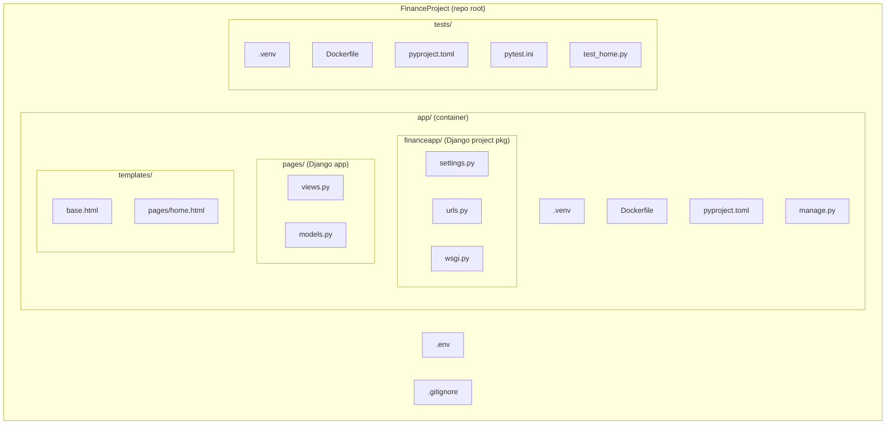

# Django Project Setup Plan

## Target Directory Structure

```
FinanceProject/
├── app/                          # Container directory
│   ├── .venv/                    # uv venv (Python 3.12, gitignored)
│   ├── Dockerfile
│   ├── pyproject.toml            # uv-managed dependencies
│   ├── uv.lock
│   ├── manage.py
│   ├── financeapp/               # Django project package (settings, urls, wsgi)
│   │   ├── __init__.py
│   │   ├── settings.py
│   │   ├── urls.py
│   │   ├── wsgi.py
│   │   └── asgi.py
│   ├── pages/                    # First Django app
│   │   ├── __init__.py
│   │   ├── admin.py
│   │   ├── apps.py
│   │   ├── models.py
│   │   ├── views.py
│   │   ├── urls.py
│   │   └── migrations/
│   └── templates/
│       ├── base.html
│       └── pages/
│           └── home.html
├── tests/
│   ├── .venv/                    # uv venv (Python 3.12, gitignored)
│   ├── Dockerfile
│   ├── pyproject.toml            # uv-managed dependencies
│   ├── uv.lock
│   ├── pytest.ini
│   └── test_home.py              # Starter smoke test
├── .env
├── .gitignore
└── README.md
```

The outer `app/` is just a container directory. Inside it, `financeapp/` is the Django project Python package (holding `settings.py`, `urls.py`, etc.), and `pages/` is a Django app sitting alongside it. This avoids the confusing `financeapp/financeapp/` double-nesting while keeping the Django package properly named.




## Step-by-step

### 1. Clean up partial setup

- Remove files from the earlier aborted setup and the root-level `.venv`

### 2. Create `app/` Django project

- `mkdir app && cd app`
- `uv init` to create `pyproject.toml`, then add dependencies: `django`, `psycopg2-binary`, `gunicorn`
- `uv venv .venv --python=3.12`
- `uv run django-admin startproject financeapp .` -- creates `manage.py` + `financeapp/` package
- `uv run python manage.py startapp pages` -- creates the first app

### 3. Configure Django settings

- In `app/financeapp/settings.py`:
  - Register `pages` in `INSTALLED_APPS`
  - Set `TEMPLATES DIRS` to `BASE_DIR / 'templates'`
  - Configure `DATABASES` for PostgreSQL using `os.environ` (from `.env`):
    - ENGINE, HOST, PORT, NAME, USER, PASSWORD
  - Set `STATIC_URL` and `STATICFILES_DIRS`

### 4. Create the one-page view and template

- `pages/views.py`: `HomePageView` using `TemplateView`
- `pages/urls.py`: route `''` to `HomePageView`
- `financeapp/urls.py`: include `pages.urls`
- `app/templates/base.html`: base HTML skeleton
- `app/templates/pages/home.html`: landing page extending base

### 5. Create `app/Dockerfile`

- Based on `python:3.12-slim`
- Install uv, system deps for PostgreSQL (`libpq-dev`)
- Copy `pyproject.toml` + `uv.lock`, run `uv sync`
- Copy app code
- Expose port 8000, run with `gunicorn`

### 6. Create `tests/` directory

- `mkdir tests && cd tests`
- `uv init` to create `pyproject.toml`, then add: `pytest`, `requests`
- `uv venv .venv --python=3.12`
- Selenium/Playwright can be added later when needed

### 7. Create `tests/Dockerfile`

- Based on `python:3.12-slim`
- Install uv
- Copy `pyproject.toml` + `uv.lock`, run `uv sync`
- Copy test files
- Default CMD: `uv run pytest`

### 8. Create test scaffolding

- `tests/pytest.ini`: basic config
- `tests/test_home.py`: a simple smoke test that hits `http://app:8000/` and asserts HTTP 200

### 9. Update root files

- Update `.gitignore` to cover both `.venv/` dirs, `__pycache__/`, `db.sqlite3`, `.env`
- Update `README.md` with setup and run instructions

